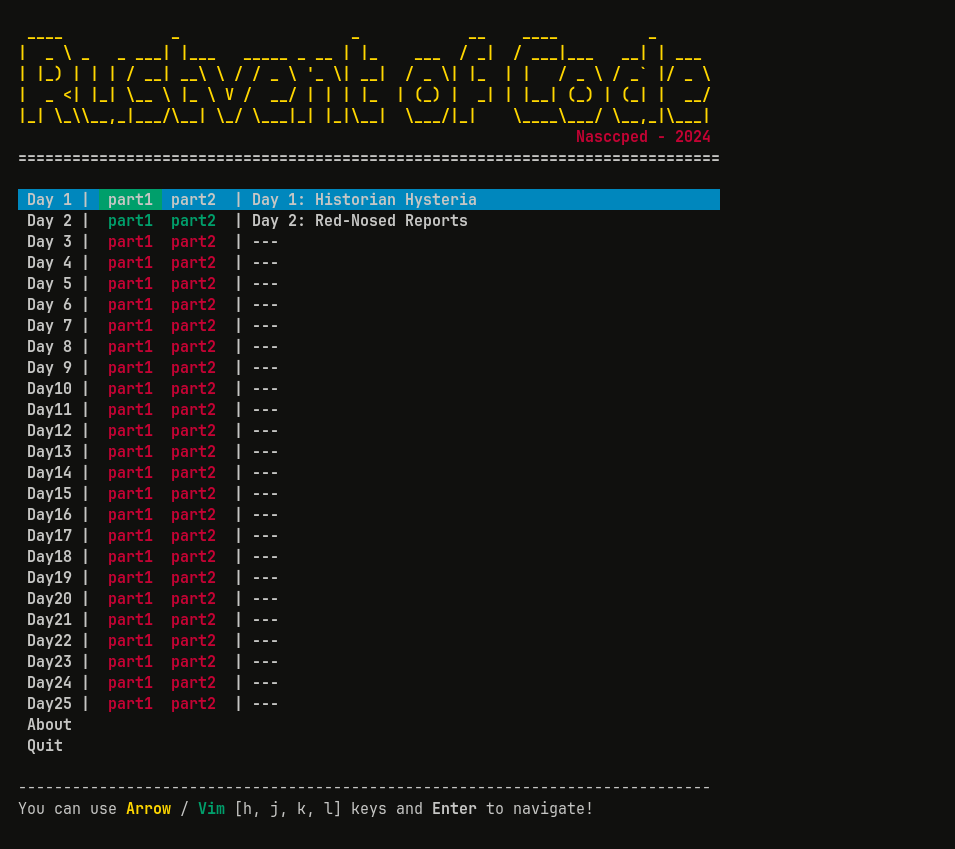

Rustvent of Code 2024 🎄
========================

Welcome to **Rustvent of Code 2024**, my personal
[Advent of Code][advent-of-code-link] solutions made entirely in
[Rust][rustlang-link] 🦀 language!

<table>
<tr>
   <th colspan="3">Demo</th>
<tr>
<tr>
   <td>Main Menu</td>
   <td>Day 2 Scenario</td>
   <td>Endscreen</td>
</tr>

<tr>
   <td></td>
   <td></td>
   <td></td>
</tr>
</table>


## What's AoC?

Basically, [Advent of Code][advent-of-code-link] is an advent
calendar containing _general-skills_ programming puzzles. These
puzzles can be solved using any language, so, I decided to try Rust!

Are you curious about how **AoC** works? Take a look at AoC about
page by clicking [here][aoc-about-link].


## Get, build and run

Did you want to try this program? Fine!

There is some requirements:
- [Git][git-link]
- [Rust Compiler][rustlang-link]
- [Cargo Package Manager][cargo-link]
- IDE (e.g., [VS Code][vs-code-link],
  [JetBrains RustRover][rustrover-link], [Neovim][neovim-link]) is
  optional _(But recomended)_

### Step by Step

1. Firstly, clone the repository:

   ```shell
   git clone https://github.com/nasccped/rustvent-of-code-2024

   # this will clone the repo to your current working directory
   # make sure that the current directory doesn't have another folder
   # called rustvent-of-code-2024. This can cause an error

   git clone https://github.com/nasccped/rustvent-of-code-2024 name_of_your_choice

   # use the command above to clone the directory with an alias.
   # don't forget to replace 'name_of_your_choice'
   ```

2. Goto cloned repo:

   ```shell
   cd ./rustvent-of-code-2024
   
   # it will change your current working directory to the cloned repo,
   # or you can also use the following:

   cd ./name_of_your_choice

   # if an alias has been used
   ```

3. Run the project:

   ```shell
   cargo run

   # the command above will compile and run the entire project to
   # you! Don't worry about manual compile :^)
   ```


> [!NOTE]
>
> I'm still learning the Rust language, so... some files can be
> useless, bad structured, bad commented, with some bugs and a lot
> more.
>
> Sorry for this, but I promise to improve in these mistakes.


<!-- links -->
[advent-of-code-link]: https://adventofcode.com/2024
[rustlang-link]: https://www.rust-lang.org/
[cargo-link]: https://doc.rust-lang.org/cargo/
[aoc-about-link]: https://adventofcode.com/2024/about
[git-link]: https://git-scm.com/
[rustrover-link]: https://www.jetbrains.com/rust/
[vs-code-link]: https://code.visualstudio.com/
[neovim-link]: https://neovim.io/
